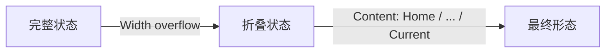

# Skill: BreadCrumbs (面包屑)

[Metadata]
- **Component Name**: BreadCrumbs
- **Figma Node**: 23:101
- **DevUI Component**: `d-breadcrumb`
- **Version**: v1.1

## Property Skill
定义组件的 API 接口，确保与 DevUI 标准对齐。

| Prop Name | Type | Description | Default |
| :--- | :--- | :--- | :--- |
| `source` | `Array<SourceType>` | 面包屑数据源，包含标题、链接等信息 | `[]` |
| `separatorIcon` | `ReactNode \| TemplateRef` | 自定义分隔符图标 | `'/'` |
| `size` | `'sm' \| 'md' \| 'lg'` | 尺寸大小（预留） | `'md'` |

**SourceType Definition**:
```typescript
interface SourceType {
  title: string;
  link?: string;
  target?: '_blank' | '_self' | '_parent' | '_top';
  noNavigation?: boolean; // Whether to disable navigation (mapped to Active state)
}
```

## Visual Skill
定义视觉还原的严格规范，强制使用 Token 和 Flex 布局。

### 1. Layout Logic (布局逻辑)
组件采用三层嵌套 Flex 结构，严格遵循以下间距逻辑：

1.  **Root Container (`.devui-breadcrumb`)**
    -   `display: flex`
    -   `align-items: center`
    -   `flex-wrap: wrap`
    -   `gap: 0px` (Item 之间无间距，间距由 Separator 自身宽度提供)

2.  **Item Wrapper (`.devui-breadcrumb-item`)**
    -   `display: flex`
    -   `align-items: center`
    -   `gap: 0px` (内容组与分隔符之间无 Gap)

3.  **Content Group (`.item-content`)** (Text + Optional Icon)
    -   `display: flex`
    -   `align-items: center`
    -   `gap: 4px` (文本与右侧下拉图标之间的原子间距)

4.  **Separator (`.separator`)**
    -   `width: 16px` (固定宽度)
    -   `display: flex; justify-content: center; align-items: center`
    -   利用固定宽度形成自然的左右视觉间距，禁止使用 margin。

### 2. Responsiveness (响应式策略)
**Collapse Logic (折叠逻辑)**:
当面包屑总宽度超过父容器宽度时，触发折叠机制：
1.  **保留项**：
    -   First Item (首页/根节点) 永远显示。
    -   Last Item (当前页) 永远显示。
2.  **折叠顺序**：
    -   从 **第 2 个** 面包屑 (Index 1) 开始折叠。
    -   将中间项替换为 `...` (Ellipsis) 图标或文本。
    -   如果空间仍不足，继续折叠后续项，直到仅剩 `First ... Last` 或宽度适配为止。
3.  **交互**：
    -   Hover `...` 时，应显示包含被折叠项的下拉菜单 (Dropdown)。



### 3. Styling Rules (样式映射)

| Component Part | CSS Property | Token / Value | Fallback (Hex) |
| :--- | :--- | :--- | :--- |
| **Item Text (Normal)** | `color` | `var(--devui-text-weak)` | `#575D6C` |
| **Item Text (Hover)** | `color` | `var(--devui-text-weak)` | `#575D6C` |
| **Item Text (Active/Current)** | `color` | `var(--devui-text)` | `#252B3A` |
| **Separator** | `color` | `var(--devui-placeholder)` | `#8A8E99` |
| **Font** | `font-family` | `'Noto Sans SC', sans-serif` | - |
| **Font Size** | `font-size` | `14px` | - |
| **Line Height** | `line-height` | `22px` | - |

> [!NOTE]
> 交互状态提示：
> - Hover 上一级面包屑链接时，文本颜色建议变为 `var(--devui-primary)` 或增加下划线。
> - Active (当前页) 状态通常不可点击。

## Anti-Patterns (负面示例)
禁止在生成代码时出现以下模式：

1.  **❌ 禁止禁止错误的容器 Gap**
    ```css
    /* Bad */
    .devui-breadcrumb { gap: 8px; } /* Should be 0, spacing is in separator */
    ```

2.  **❌ 禁止使用 Margin 模拟 Separator 宽度**
    ```css
    /* Bad */
    .separator { margin: 0 8px; }
    /* Good */
    .separator { width: 16px; justify-content: center; }
    ```

3.  **❌ 禁止混淆 Text Gap 与 Item Gap**
    - `gap: 4px` 仅用于 Text 与 Icon 之间，**不是** Item 之间的间距。

## Audit Checklist (自检清单)
- [ ] Root Container 设置为 `gap: 0`？
- [ ] 分隔符是否使用 `width: 16px` 固定宽度？
- [ ] 文本与图标（如有）之间是否有 `gap: 4px`？
- [ ] 普通文本颜色 `devui-text-weak`，当前页文本颜色 `devui-text`？
- [ ] 是否避免了使用 `margin` 来控制间距？
